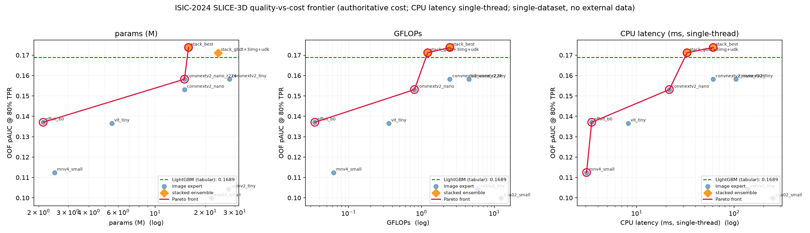

# ISIC-2024 SLICE-3D — efficiency-frontier skin-lesion classification

[](https://github.com/junaidaliop/isic2024-tbp/actions/workflows/ci.yml)
[](pyproject.toml)
[](LICENSE)
[](docs/CITATIONS.md)

A single-dataset, **no-external-data, no-synthetic** study of the ISIC-2024 SLICE-3D skin-cancer
task. Instead of chasing the unconstrained private-leaderboard number — the winners reached
~0.173 only with external dermoscopy data **and** ~30k diffusion-synthesised positives, both
deliberately banned here — this project maps the **quality-vs-cost Pareto frontier**: the best
pAUC@80%TPR per unit of inference cost, on ISIC-2024 data alone.

> **Claim:** state of the art *among single-dataset, no-external, no-synthetic* solutions,
> reported on a quality–efficiency frontier. The unconstrained ~0.173 is out of reach by
> construction — and quantifying that gap honestly is the point.

**Companion website:** <https://junaidaliop.github.io/isic2024-tbp/>
([report PDF](docs/ISIC2024-report.pdf) · [slides](docs/ISIC2024-slides.pdf))

## Results (out-of-fold, official pAUC@80%TPR ∈ [0, 0.20])

| model | pAUC@80%TPR | params (M) | GFLOPs | CPU ms* |
|---|---|---|---|---|
| LightGBM + CatBoost (tabular, bagged) | **0.1689** | — | ~0 | ~0 |
| best image expert (ConvNeXt-V2-nano @224) | 0.1582 | 15.0 | 2.46 | 61 |
| **stack** — rank-avg(tabular, image) | **0.1738** | 15.8 | 2.46 | 61 |
| cheapest image (EfficientViT-b0 @128) | 0.1371 | 2.1 | 0.034 | 3.5 |

\* median single-image latency, 1 thread. Patient-grouped 5-fold CV; every number is
re-scored only by `src/cv.py` and was reproduced from disk during review.

Key findings: the patient-relative "ugly-duckling" features carry ~65% of the GBDT's gain;
the image branch adds a real but modest +0.005 over tabular alone; and the **trivial
rank-average combiner beats** the meta-learner and a learned gate at 393 positives (the
negative results are reported, not hidden).



## Method

Two experts and a trivial combiner, all sharing one frozen validation split.

- **Metric & validation.** The official score is partial AUC above 80% TPR (pAUC@80, range
  `[0, 0.20]`; random ≈ 0.02, perfect = 0.20), computed only by `src/cv.py`. Folds are
  patient-grouped, target-stratified 5-fold (SEED 42) so no patient straddles folds;
  out-of-fold (OOF) predictions are scored once on the full vector.
- **Tabular expert** (`src/features.py`, `src/gbdt.py`). From ISIC-2024 metadata only: lesion
  geometry and size ratios, L\*/A\*/B\* colour and lesion-vs-skin contrast, border/shape
  composites, 3D body position, and patient-relative *ugly-duckling* deviations
  (`pdev_`/`prank_`/`pxc_`) with fold-local target encoding. A bagged LightGBM + CatBoost
  ensemble (manual undersampling, pAUC early-stopping) reaches OOF **0.1689**; the
  patient-relative block alone is ~65% of the gain.
- **Image expert** (`src/vision/`). Small ImageNet-pretrained backbones (ConvNeXt-V2-nano is the
  optimum) at 128–224 px. Recipe: AdamW (1e-4, weight decay 1e-3), cosine schedule, 30 epochs,
  batch 128; per-epoch negative undersampling (~1:1); BCE + label smoothing 0.05; classical
  `transV2` augmentation (flips/transpose, brightness/contrast, blur/noise, optical/grid/elastic
  distortion, CLAHE, hue–saturation, shift–scale–rotate, coarse-dropout — **no generative
  augmentation**); weight EMA (0.995) and mixup (α = 0.2). Each backbone emits an OOF malignancy
  probability and an embedding. Best image OOF: **0.1582**.
- **Combiner** (`src/stack.py`). A parameter-free rank-average of the two OOF probabilities →
  **0.1738**. At 393 positives this beats a meta-LightGBM stacker, a learned per-lesion gate, and
  PCA-embedding injection — all reported as negative results.

## Design

- **Validation is the whole game.** `src/cv.py` is the single source of truth for the official
  metric (pAUC above 80% TPR) and for patient-grouped, target-stratified folds with a hard
  no-leak guarantee; `tests/test_cv.py` proves it is numerically identical to the vendored
  official scorer (`src/metric_official.py`, © 2024 N. R. Kurtansky, MSKCC). Every model reads
  the same frozen `data/folds.parquet`.
- **Tabular GBDT first; the image model earns its place.** The signal lives in the metadata
  (geometry, colour contrast, size, patient-relative deviations). A bagged LightGBM+CatBoost is
  the efficient anchor; small ImageNet-pretrained image experts contribute an OOF probability
  (and embeddings) that are stacked in only if cross-validation lifts pAUC.
- **Efficiency is a first-class axis.** Every model logs params, FLOPs, and CPU latency, so each
  is a point on the Pareto frontier (`reports/frontier.py`).

## Quickstart

```bash
conda create -y -n isic2024 python=3.12 && conda activate isic2024
pip install torch torchvision --index-url https://download.pytorch.org/whl/cu128   # CUDA 12.8
pip install -e ".[dev]"                                                            # + kaggle, pre-commit
# CPU-only: swap the index for https://download.pytorch.org/whl/cpu
# exact pins: pip install -r requirements-lock.txt

make data       # download SLICE-3D into data/ (accept the Kaggle competition rules first)
make folds      # freeze patient-grouped folds + metric sanity — ALWAYS first
make test       # spine tests: metric anchors, no-leak, official-equivalence
make gbdt       # bagged tabular model -> OOF + pAUC  (0.1689)
make vision CFG=configs/vision/convnextv2_nano_r224.yaml   # an image expert -> OOF + embeddings
python experiments/run_stack.py    # combine -> stack OOF (0.1738) + frontier row
make frontier   # Pareto figures (pAUC vs params / GFLOPs / CPU ms)
make site       # render the companion website -> docs/
```

## Reproducibility

Single seed (42) everywhere; every run is config-driven (`configs/`) and logged; the env is
pinned via `requirements-lock.txt` / `environment.yml`. Full step-by-step instructions and the
grader command sequence are in [`REPRODUCE.md`](REPRODUCE.md). Tabular and folds are bit-exact;
image retrains match to run-to-run noise (cuDNN). Negative results are kept, not deleted.

## Submission (closed competition)

ISIC-2024 was a Kaggle *code* competition: the private score comes only from a notebook run on
the hidden test set (the public test shipped with the data is a 3-row placeholder). `src/submit.py`
builds a format-valid `submission.csv` from the saved tabular models; the estimated private score
from CV is ~0.155–0.165, competitive with the best no-external/no-synthetic entries. See the
[Submission page](https://junaidaliop.github.io/isic2024-tbp/submission.html) for the
late-submission procedure.

## Team — Pakistan.AI

Neural Networks course project, CSIE, National Yunlin University of Science and Technology.

| Member | Student ID |
|---|---|
| Raja, Muhammad Junaid Ali Asif ([ORCID 0009-0008-9249-9983](https://orcid.org/0009-0008-9249-9983)) | M11217073 |
| Sultan, Adil | M11217078 |
| Hassan, Shahzaib Ahmed | M11217081 |

## Repository layout

```
src/cv.py            validation spine: official pAUC + frozen patient-grouped folds
src/metric_official  vendored official ISIC-2024 scorer (verbatim, attributed)
src/features.py      intrinsic, leak-free tabular feature engineering
src/gbdt.py          bagged LightGBM/CatBoost expert + OOF
src/vision/          small pretrained image experts + OOF/embeddings
src/efficiency.py    params / FLOPs / CPU latency
src/stack.py         combiner + frontier logging
src/submit.py        submission builder
experiments/run_stack.py   the stack ablation + headline OOF
reports/             frontier + EDA + performance figure generators
site/                Quarto companion website (renders to docs/)
docs/                rendered website + report/slides PDFs
```

## Citing

See [`CITATION.cff`](CITATION.cff) (GitHub renders a "Cite this repository" button). Please also
cite the SLICE-3D dataset and the official metric — details in [`docs/CITATIONS.md`](docs/CITATIONS.md).

## License

Code: MIT ([`LICENSE`](LICENSE)). Data is **not** included and not MIT — ISIC-2024 SLICE-3D is
CC BY-NC 4.0; obtain and attribute it separately (`docs/CITATIONS.md`).
</content>
