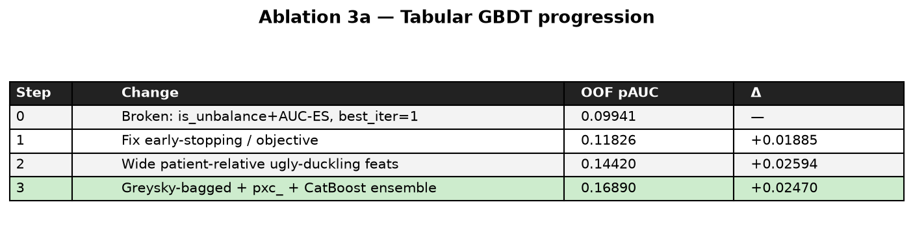
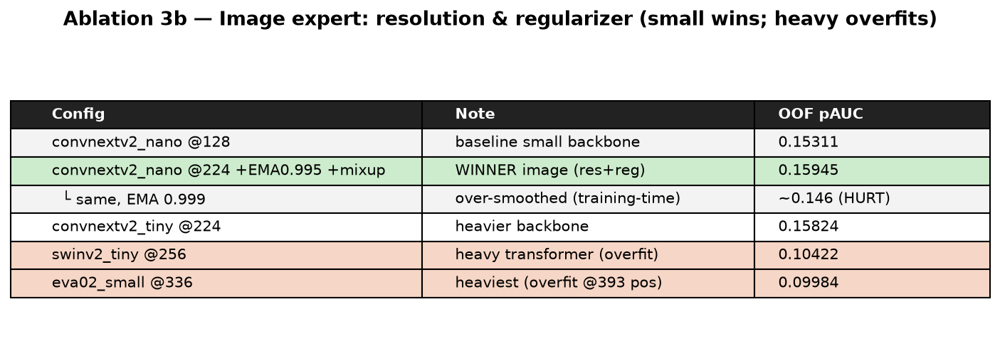
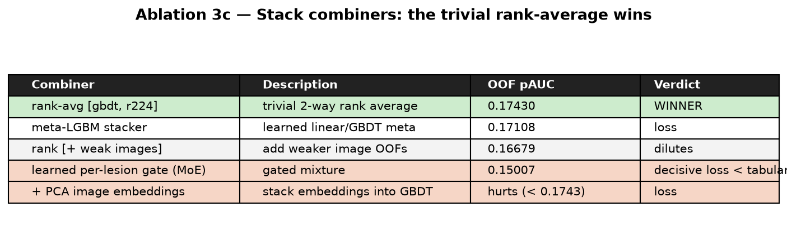

::: {.callout-important}
## The thesis of this page
We log negative results honestly; we never quietly drop a model that did not help. The headline
finding of the entire study is visible here in one sentence: **almost every increase in model
complexity lost.** At 393 positives, the efficient, trivial choices — a small backbone, a
rank-average combiner, intrinsic tabular features — are not just cheaper, they are also *more
accurate*. That negative result is the contribution.
:::

## Tabular GBDT progression {#tabular}

{#fig-abl-tab}

| Step | Change | OOF pAUC | Δ |
|---|---|---:|---:|
| 0 | **Broken:** `is_unbalance` + AUC early-stop → `best_iter = 1` | 0.09941 | — |
| 1 | Fix early-stopping / objective (drop `is_unbalance`, early-stop on pAUC) | 0.11826 | **+0.01885** |
| 2 | Wide patient-relative ugly-duckling features (`pdev_` / `prank_` / `pxc_`) | 0.14420 | **+0.02594** |
| 3 | Greysky-bagged LightGBM + `pxc_` + CatBoost rank-blend | **0.16890** | **+0.02470** |

**Takeaways.** The broken config scored barely above 5× random — a reminder that on extreme
imbalance the *training setup* dominates the *model*. The **patient-relative feature block
(Step 2) is the single biggest jump (+0.026)**, confirming the ugly-duckling thesis. Bagging +
CatBoost (Step 3) adds another +0.025 from variance reduction across seeds and families.

## Image expert — resolution & regularizer {#image}

{#fig-abl-img}

| Config | OOF pAUC | Verdict |
|---|---:|---|
| `convnextv2_nano` &#64;128 | 0.15311 | baseline image point |
| **`convnextv2_nano` &#64;224 + EMA0.995 + mixup** | **0.15945** | best image — the sweet spot |
| ↳ same, EMA **0.999** | ~0.146 | **HURT** (over-smooths at ~23 steps/epoch) |
| `convnextv2_tiny` &#64;224 | 0.15824 | slightly *worse* than nano, ~2× the cost |
| `swinv2_tiny` &#64;256 | 0.10422 | **collapse** — near random |
| `eva02_small` &#64;336 | 0.09984 | **collapse** — near random |

**Takeaways.** Resolution + light **EMA(0.995)** + mixup on the **small** nano backbone is the
sweet spot. Stronger EMA (0.999) over-smooths because the undersampled epochs are tiny. Heavy
transformers (Swin, EVA-02) **collapse to near-random** — textbook overfitting at 393 positives:
more capacity, less signal. Even `convnextv2_tiny` (2× nano's params) is *worse* than nano.

## Stack combiners {#stack}

{#fig-abl-stack}

| Combiner | OOF pAUC | Verdict |
|---|---:|---|
| **rank-avg [GBDT, nano@224]** | **0.17430** | **WINNER** |
| meta-LGBM stacker | 0.17108 | loses to trivial |
| rank [+ weak images] | 0.16679 | dilutes |
| learned per-lesion gate (MoE) | 0.15007 | **decisive loss** — below tabular 0.16890 |
| + PCA image embeddings into GBDT | < 0.17430 | **hurts** |

**Takeaways.** The **trivial 2-way rank-average wins outright.** Every learned or heavier
combiner loses, and the **MoE gate even falls *below the tabular expert alone*** (0.150 <
0.169). Adding weak images, or stuffing PCA embeddings into the GBDT, dilutes rather than helps.

::: {.callout-note appearance="simple"}
**A note on reconstructions.** A recomputed rank-average over {GBDT + 4 image OOFs} scores
0.16917; the logged "rank [+ weak images]" run (0.16679) used a different weak-image set and is
kept as the authoritative logged number. Either way the conclusion holds — adding weak images
dilutes. This is the kind of detail we surface rather than smooth over.
:::

## Negative results, in one figure {#negatives}

{#fig-neg}

| Idea tried | Its pAUC | Beaten by | Honest finding |
|---|---:|---|---|
| Learned per-lesion gate (MoE) | 0.15007 | 0.16890 (tabular) | **loses to tabular alone** |
| Meta-LGBM stacker | 0.17108 | 0.17430 (rank-avg) | loses to trivial rank-avg |
| + PCA image embeddings into GBDT | < 0.1743 | 0.17430 | embeddings **hurt** |
| Heavy backbones (SwinV2 / EVA-02) | 0.104 / 0.100 | 0.15945 (nano@224) | dominated — overfit at 393 pos |
| EMA 0.999 (over-smoothing) | ~0.146 | 0.15945 (EMA0.995) | stronger EMA hurts |

## Why "everything complex lost" is the finding

There is a structural reason every learned add-on failed: each one must estimate its parameters
from the **same 393 positives** the base experts already consumed. A rank-average has **zero
parameters**, so it cannot overfit the validation folds; a meta-learner, a gate, or extra
embedding dimensions all have parameters to fit and not enough fresh positive signal to fit them
well. The result generalizes a classical lesson to the extreme-imbalance regime: **when positives
are scarce, model selection should bias hard toward zero-parameter fusion and small backbones.**
That is the defensible, reusable claim this study contributes — and it is *also* the cheapest
option, which is why it sits on the efficiency frontier.

---

*Continue to [Reproducibility →](reproducibility.qmd)*
