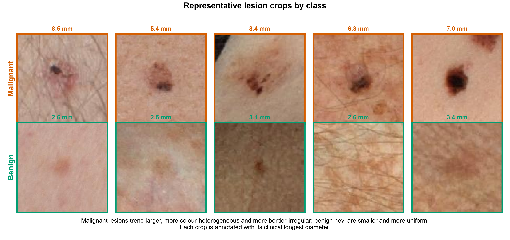
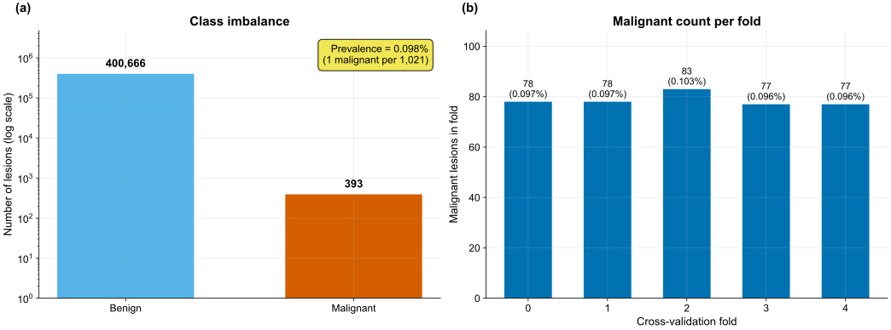
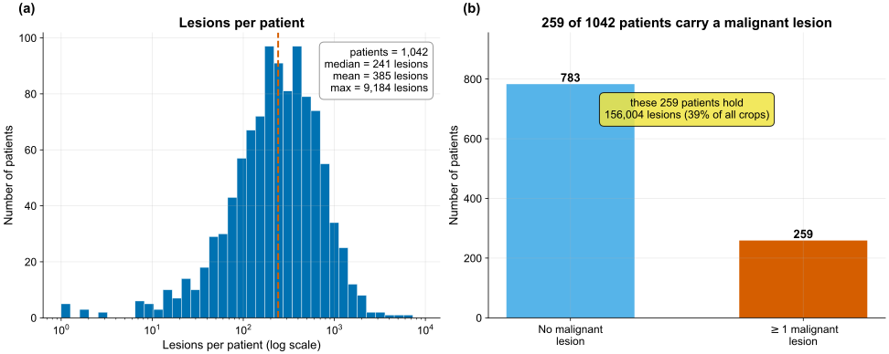
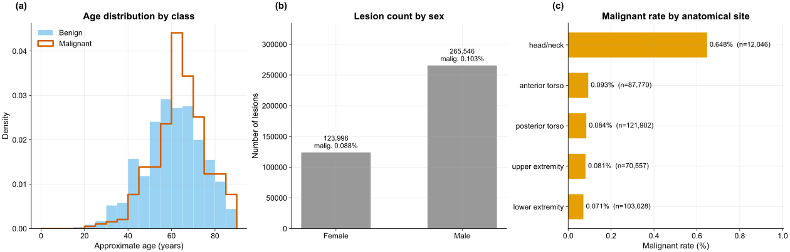
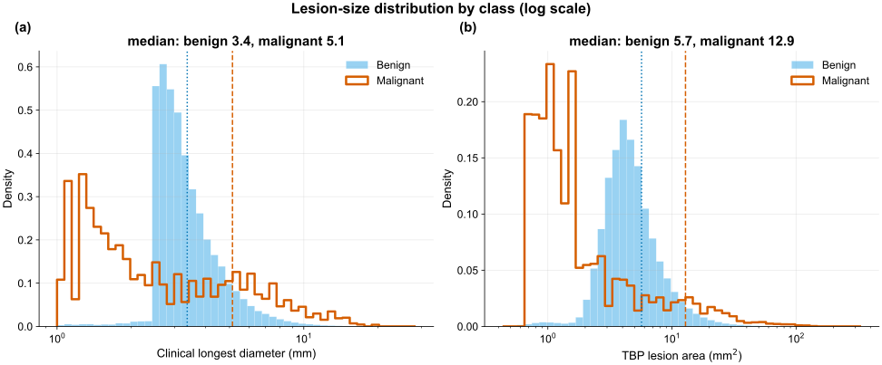
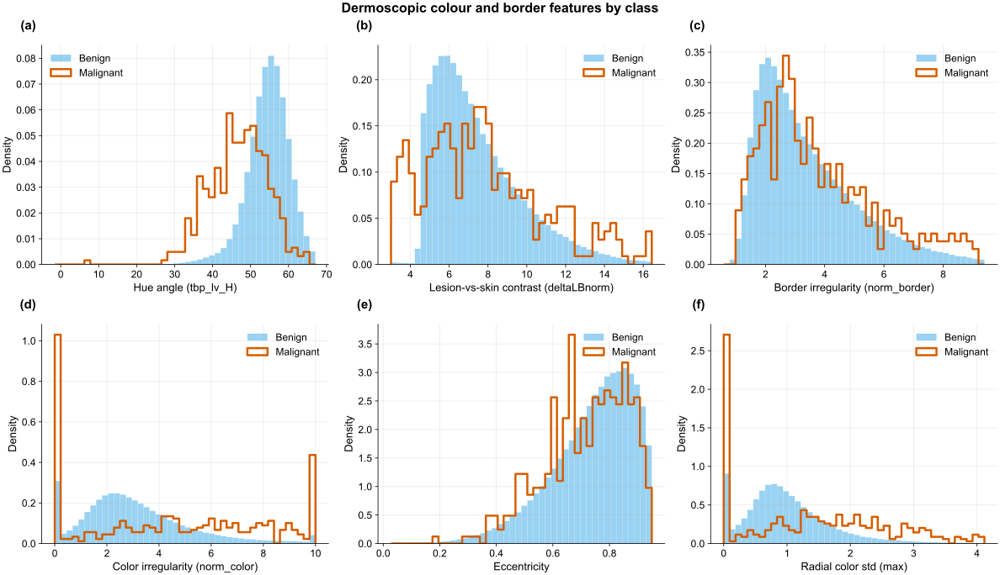
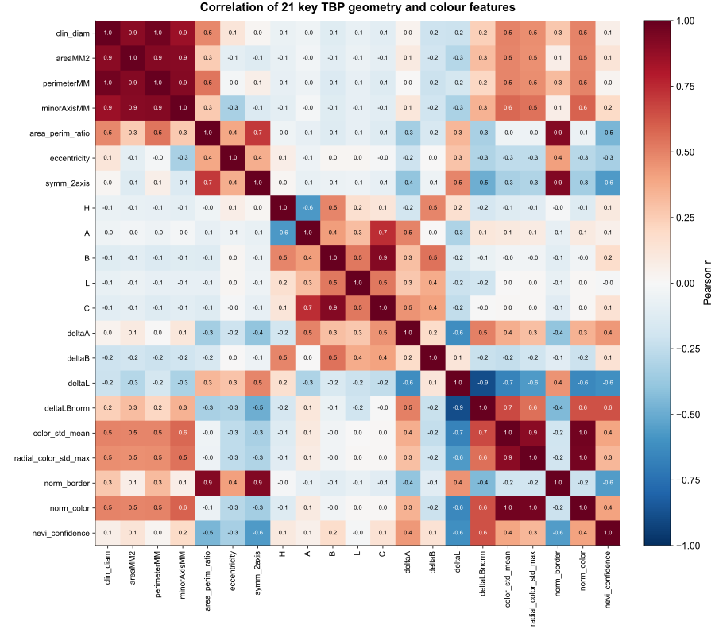
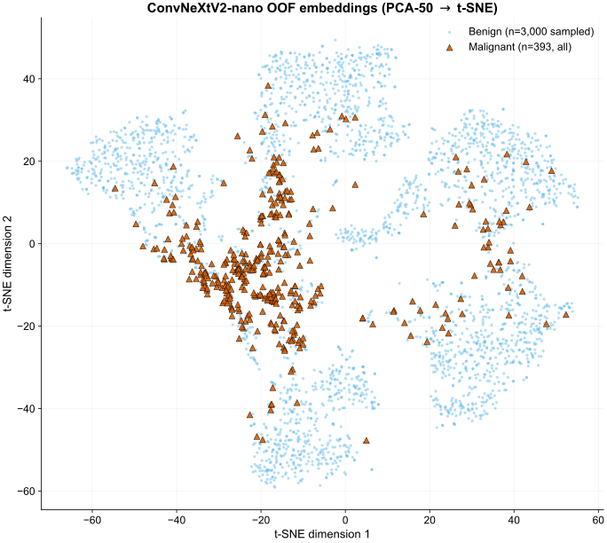
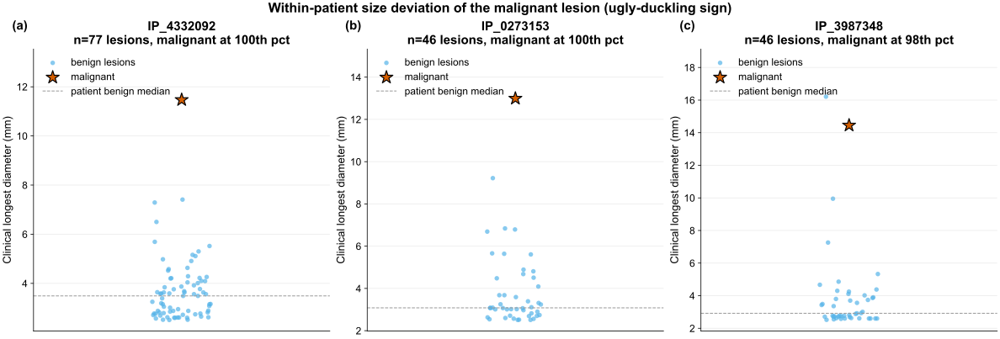

## The problem

The task is automated triage of skin-lesion crops extracted from **3D total-body photography
(TBP)**: each crop must be classified as malignant or benign so that high-risk lesions are
flagged for clinical review. The clinical objective is high sensitivity — catching nearly every
malignancy — at an acceptable false-positive rate.

## The dataset

ISIC-2024 **SLICE-3D** is a corpus of lesion crops from TBP, which images every visible mole on
a patient in a single capture. Each row is one lesion: a small square JPEG crop plus a tabular
record of measurements computed by the TBP vendor's software (geometry, color, 3D position) and
clinical context (age, sex, body site).

| Fact | Value |
|---|---|
| Lesion crops (rows) | **401,059** |
| Malignant lesions | **393** |
| Benign lesions | **400,666** |
| Prevalence | **0.098%** — about **1 malignant per 1,021 crops** |
| Unique patients | **1,042** |
| Patients with ≥1 malignant lesion | **259** (24.9%) |
| Columns | 55 (35 float, 18 string, 2 int) |
| Real (non-leak) feature columns | **36** |
| Imaging | every crop is a TBP tile (`TBP tile: close-up`); 2 subtypes (`3D: XP`, `3D: white`) |
| Source institutions | 7 (MSKCC, Hospital Clínic Barcelona, Univ. Basel, Frazer Institute/UQ, ACEMID MIA, MedUni Vienna, Univ. Athens) |

Data are **patient-grouped**: a patient contributes many correlated lesions, so the unit of
independence is the patient, not the crop.

### Representative crops

{#fig-eda0}

::: {.callout-important}
## The challenge

- **Extreme class imbalance.** At 0.098% prevalence, a constant "benign" predictor is 99.9%
  accurate and clinically useless. With only 393 positives, fold variance and leakage dominate
  model choice.
- **The official metric.** Scoring uses partial AUC above 80% TPR (pAUC@80), the area under the
  ROC restricted to the high-sensitivity tail — see
  [Methods → The metric](methods.qmd#the-metric). Accuracy and plain AUC are unsuitable.
- **No external, no synthetic.** Only SLICE-3D is permitted; no external dermoscopy archives and
  no generative/synthetic positives. ImageNet-pretrained weights are allowed; external training
  data is not.
- **Efficiency is a first-class axis.** Every reported model logs parameters, FLOPs, and
  single-thread CPU latency alongside pAUC; a model is retained only if it earns its cost.
:::

### Image details

The crops are variable-size square JPEGs, **61–239 px** on a side (median/mean ≈ **131/133 px**),
~2.8 KB each. Two consequences for the image experts:

- **128 px ≈ native median.** Training at 128 px is near the crops' natural resolution; epochs
  are cheap and no detail is discarded.
- **224 px upsamples.** The 224 px model receives the same lesion interpolated larger, not extra
  pixels. The measured 224 px gain (0.15311 → 0.15821) is therefore a capacity / training-dynamics
  effect — larger receptive field, more effective augmentation — not added image detail.
  Resolution is treated as a frontier axis, so both points are retained.

### Missingness

Three real feature columns have missing values; all others are complete.

| Column | Missing |
|---|---:|
| `sex` | 2.87% |
| `anatom_site_general` | 1.44% |
| `age_approx` | 0.70% |

::: {.callout-warning}
## Train-only leak columns (dropped)
Several columns exist only in the training split and encode the answer or post-biopsy pathology.
They are used for EDA framing only and dropped before training:

`iddx_full`, `iddx_1` … `iddx_5` (`iddx_1` is *Benign / Malignant / Indeterminate*),
`mel_mitotic_index`, `mel_thick_mm`, `lesion_id`, and `tbp_lv_dnn_lesion_confidence`
(a vendor model's confidence — unavailable at inference and effectively a label proxy).
:::

## Exploratory figures

All figures are generated by `reports/eda/make_eda.py` (read-only on `data/`, SEED = 42,
Okabe-Ito colorblind-safe palette).

### Fig 1 — Class imbalance & fold stratification

{#fig-eda1}

400,666 benign vs 393 malignant (0.098% prevalence). The five patient-grouped CV folds each
hold **77–83 positives** (~0.096–0.103% prevalence per fold); stratification is tight and no
fold is starved of signal, a precondition for trustworthy OOF estimates.

### Fig 2 — Patient structure

{#fig-eda2}

1,042 patients with a heavily right-skewed lesion count (**median 241, max 9,184**). The 259
patients carrying at least one malignant lesion hold **89% of all crops**. Because a patient's
lesions are correlated, splits must be patient-grouped: any patient straddling folds leaks
information.

### Fig 3 — Demographics

{#fig-eda3}

Malignant lesions skew older (peak ~60–75), males contribute most crops, and head/neck stands
out:

| Body site | n | Malignant rate |
|---|---:|---:|
| **head/neck** | 12,046 | **0.648%** |
| anterior torso | 87,770 | 0.093% |
| posterior torso | 121,902 | 0.084% |
| upper extremity | 70,557 | 0.081% |
| lower extremity | 103,028 | 0.071% |

Head/neck carries ~7× the baseline malignant rate of any other site despite being the smallest
site — a strong site prior.

### Fig 4 — Lesion size

{#fig-eda4}

On both clinical longest diameter and TBP area, the malignant distribution is shifted ~2× larger
than benign. Raw lesion size is a strong, cheap univariate signal; its patient-relative version
is stronger (see [Ablations](ablations.qmd)).

### Fig 5 — Color & border signals

{#fig-eda5}

Hue angle (`tbp_lv_H`) separates the classes most cleanly — univariate AUC 0.81 on a single
feature. Lesion-skin contrast, border/color irregularity, and eccentricity shift toward higher
values for malignant lesions, indicating independent color/geometry signal.

### Fig 6 — Correlation of key TBP features

{#fig-eda6}

The core features form tight blocks (a size group: diameter / area / perimeter / minor-axis;
a color group: A / B / ΔA / ΔB). The GBDT therefore sees substantial redundancy; a small number
of axes capture most of the variance.

### Fig 7 — Sample lesion crops

{#fig-eda7}

Malignant lesions tend to be larger, darker, and more color-varied, but visual overlap with
benign is large. The overlap motivates a learned image expert on top of the tabular features and
explains why the image expert alone (0.15821) does not exceed the tabular expert (0.16890).

### Fig 8 — Image-embedding class separation

{#fig-eda8}

A t-SNE of the small CNN's OOF embeddings (all 393 positives + 3,000 random negatives): the
malignant points concentrate into a recognizable region of feature space. A small CNN learns a
malignancy-relevant representation, supporting the use of its OOF probability as a stacked GBDT
feature.

### Fig 9 — Ugly-duckling illustration

{#fig-eda9}

For three patients with one malignant lesion among many benign ones, the malignant lesion sits
at the top of its own patient's size distribution (98th–100th percentile) — the concrete basis
for the within-patient deviation features.

::: {.callout-tip}
## The ugly-duckling sign, quantified
- **392 of 393** malignant lesions belong to a patient who also has benign lesions, so almost
  every positive can be judged against that patient's own normal moles.
- On `clin_size_long_diam_mm`, the malignant lesion sits at a **median 88th within-patient
  percentile**; **45.7%** of malignant lesions fall in the **top 10%** of their own patient's
  lesion sizes.

This is the quantitative basis for the engineered patient-relative features.
:::

## Summary of findings

1. **Imbalance defines the task.** 0.098% prevalence motivates partial-AUC-above-80%-TPR scoring
   and mandatory patient-grouped, target-stratified CV. The folds hold 77–83 positives each with
   no patient straddling folds.
2. **Tabular signal is strong and cheap.** Hue `tbp_lv_H` reaches univariate AUC 0.81, and lesion
   size shows a clean ~2× malignant shift — the evidence base for the LightGBM-first architecture.
3. **The ugly-duckling sign is quantitatively present** and is the dominant signal in the trained
   model (~65% of GBDT gain; see [Results](results.qmd)).
4. **The small CNN adds an orthogonal axis.** Its embeddings cluster the positives despite heavy
   visual overlap in raw crops, justifying a stacked image OOF probability; head/neck's ~7×
   elevated rate provides a site prior.

---

*Continue to [Methods →](methods.qmd)*
