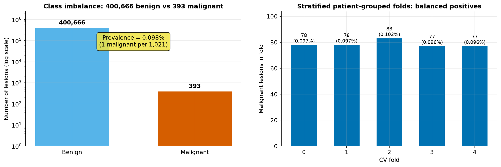
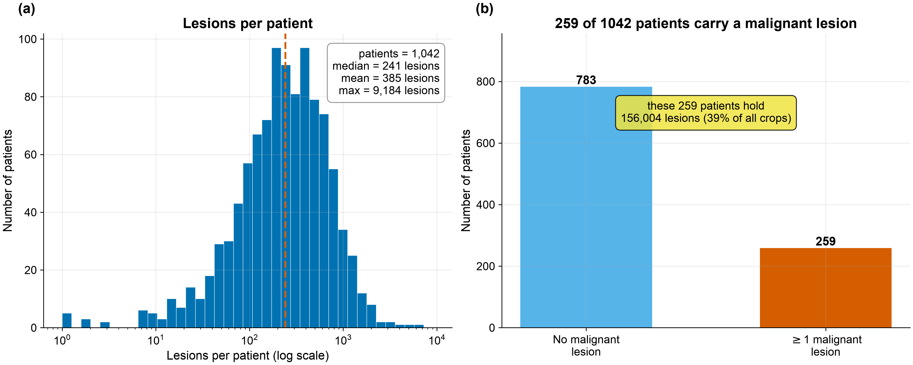
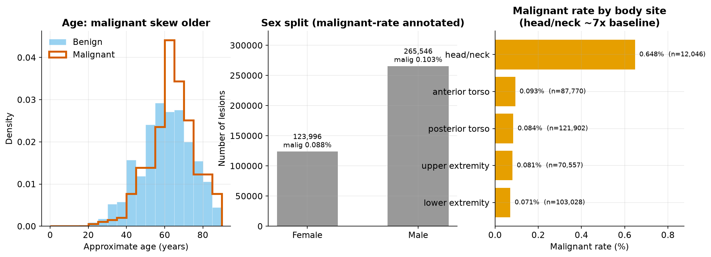
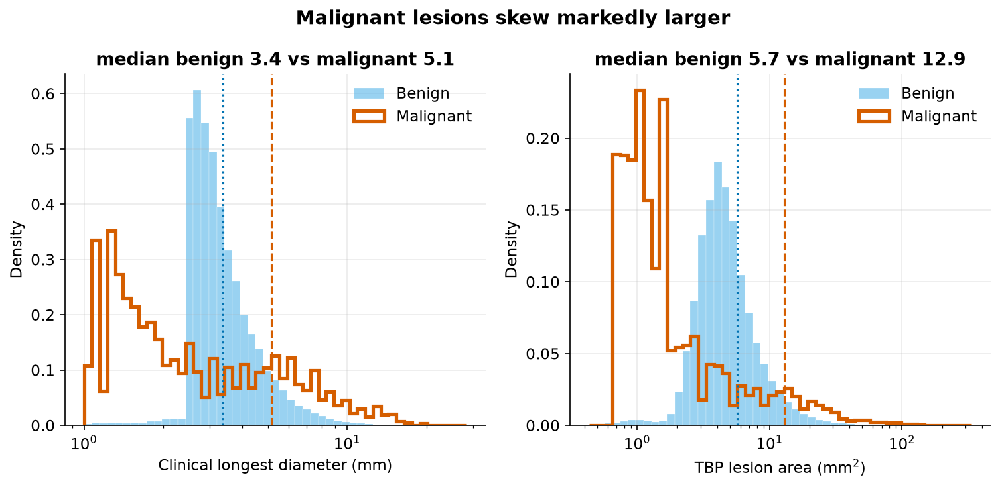
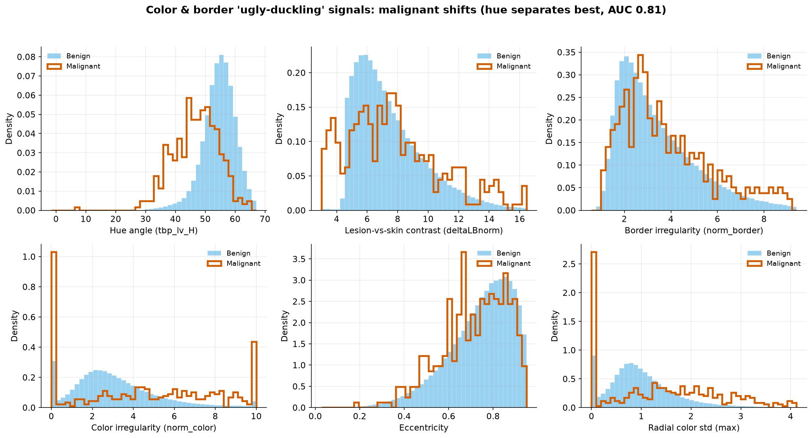
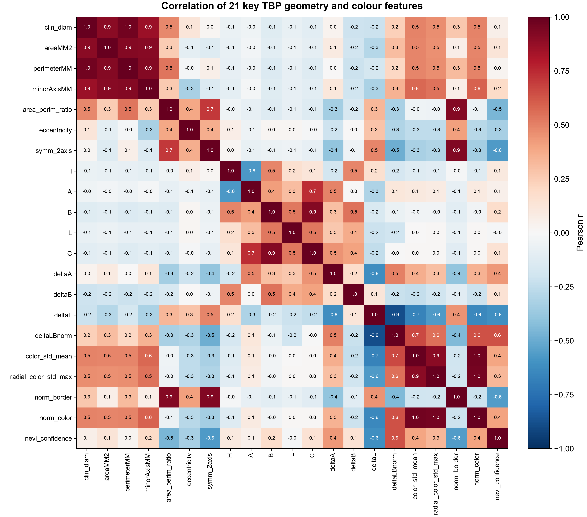
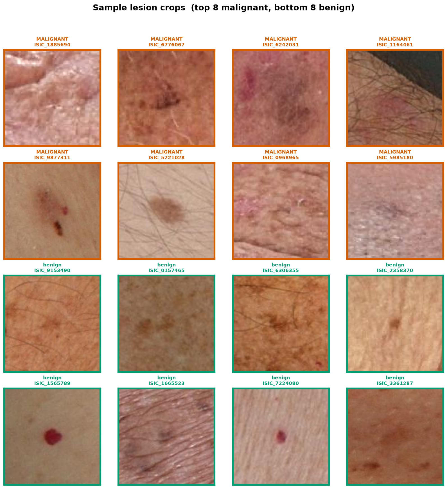
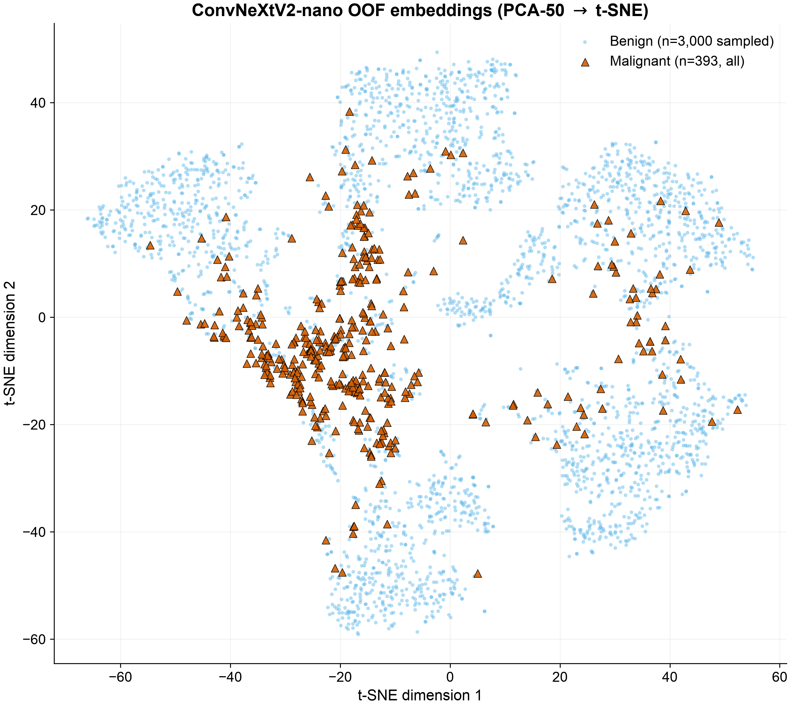
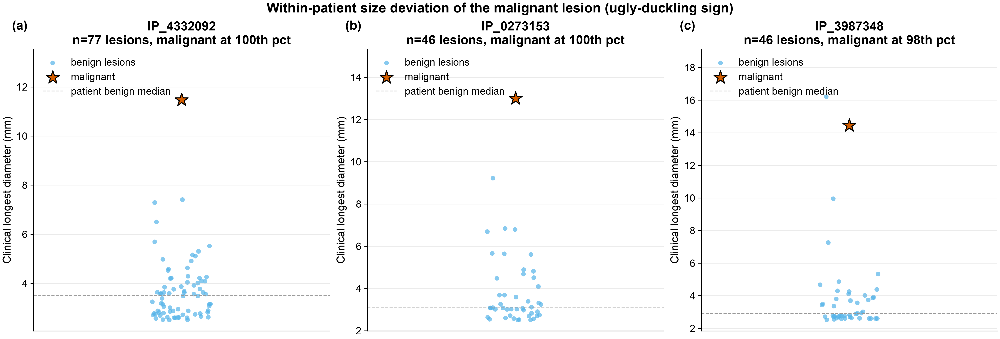

## What the data is

ISIC-2024 **SLICE-3D** is a corpus of lesion crops extracted from **3D Total-Body Photography
(TBP)** — full-body imaging that captures every visible mole on a patient at once. Each row is
one lesion, with a small square JPEG crop plus a rich tabular record of measurements computed
by the TBP vendor's software (geometry, color, 3D position) and clinical context (age, sex,
body site).

| Fact | Value |
|---|---|
| Lesion crops (rows) | **401,059** |
| Malignant lesions | **393** |
| Benign lesions | **400,666** |
| Prevalence | **0.098%** — about **1 malignant per 1,021 crops** |
| Unique patients | **1,042** |
| Patients with ≥1 malignant lesion | **259** (24.9%) |
| Columns | 55 (35 float, 18 string, 2 int) |
| Real (non-leak) feature columns | **36** |
| Imaging | every crop is a TBP tile (`TBP tile: close-up`); 2 subtypes (`3D: XP`, `3D: white`) |
| Source institutions | 7 (MSKCC, Hospital Clínic Barcelona, Univ. Basel, Frazer Institute/UQ, ACEMID MIA, MedUni Vienna, Univ. Athens) |

::: {.callout-important}
## The imbalance is the whole problem
At **0.098% prevalence**, a model that predicts "benign" for everything is 99.9% accurate and
clinically useless. This is why the task is scored by **partial AUC above 80% TPR**, not plain
accuracy or even plain AUC — see [Methods → The metric](methods.qmd#the-metric). It is also why
**patient-grouped, target-stratified** cross-validation is non-negotiable: with only 393
positives, a single leaked patient or an unlucky split can swing the score more than any model
choice.
:::

### Image details (and why we train at 128 / 224 px)

The crops are **variable-size square JPEGs**, ranging from **61 px to 239 px** on a side
(median / mean ≈ **131 / 133 px**), and only **~2.8 KB each**. Two consequences for our image
experts:

- **128 px ≈ the native median.** Training at 128 px is essentially training at the crops'
  natural resolution — no information is being thrown away, and epochs are cheap.
- **224 px *upsamples*.** The 224 px model does **not** see extra pixels; it sees the same lesion
  interpolated larger. So the measured 224 px gain (0.15311 → 0.15821) is a **capacity /
  training-dynamics** effect (a bigger receptive field for the pretrained backbone, more
  effective augmentation), **not** extra image detail. We keep both points because *resolution
  is a frontier axis*, and we report this caveat honestly.

### Missingness

Only three real feature columns have any missing values; everything else is 100% complete.

| Column | Missing |
|---|---:|
| `sex` | 2.87% |
| `anatom_site_general` | 1.44% |
| `age_approx` | 0.70% |

::: {.callout-warning}
## Train-only LEAK columns — we drop them
Several columns exist only in the training split and encode the **answer** or **post-biopsy
pathology**. Feeding any of them to a model is leakage; we use them for EDA framing only and
drop them before training:

`iddx_full`, `iddx_1` … `iddx_5` (`iddx_1` is literally *Benign / Malignant / Indeterminate*),
`mel_mitotic_index`, `mel_thick_mm`, `lesion_id`, and `tbp_lv_dnn_lesion_confidence`
(a vendor model's own confidence — not available at inference and effectively a label proxy).
:::

## The nine EDA figures

All figures are generated by `reports/eda/make_eda.py` (read-only on `data/`, SEED = 42,
DPI 150, Okabe-Ito colorblind-safe palette).

### Fig 1 — Class imbalance & fold stratification

{#fig-eda1}

400,666 benign vs 393 malignant (0.098% prevalence). The five patient-grouped CV folds each
hold **77–83 positives** (~0.096–0.103% prevalence per fold), so stratification is tight and
**no fold is starved of signal** — a precondition for trustworthy OOF estimates.

### Fig 2 — Patient structure

{#fig-eda2}

1,042 patients with a heavily right-skewed lesion count (**median 241, max 9,184**). The 259
patients who carry at least one malignant lesion hold **89% of all crops** — most data lives
with the high-risk patients. This is the structural reason splits **must** be patient-grouped:
a patient's lesions are correlated, so any patient straddling folds leaks information.

### Fig 3 — Demographics

{#fig-eda3}

Malignant lesions skew older (peak ~60–75), males contribute most crops, and **head/neck
stands out**:

| Body site | n | Malignant rate |
|---|---:|---:|
| **head/neck** | 12,046 | **0.648%** |
| anterior torso | 87,770 | 0.093% |
| posterior torso | 121,902 | 0.084% |
| upper extremity | 70,557 | 0.081% |
| lower extremity | 103,028 | 0.071% |

Head/neck carries **~7× the baseline malignant rate** of any other site, despite being the
smallest site — a strong site prior the model should respect.

### Fig 4 — Lesion size

{#fig-eda4}

On both clinical longest diameter and TBP area, the malignant distribution is shifted **~2×
larger** than benign. Raw lesion size is a strong, cheap univariate signal — and, as the
ablations show, its *patient-relative* version is even stronger.

### Fig 5 — Color & border "ugly-duckling" signals

{#fig-eda5}

Hue angle (`tbp_lv_H`) separates the classes most cleanly — **univariate AUC 0.81 on a single
feature**. Lesion-skin contrast, border/color irregularity, and eccentricity all shift toward
higher values for malignant, confirming the TBP color/geometry features carry real, independent
signal.

### Fig 6 — Correlation of key TBP features

{#fig-eda6}

The core features form tight blocks (a **size group**: diameter / area / perimeter / minor-axis;
a **color group**: A / B / ΔA / ΔB). The GBDT therefore sees substantial redundancy — useful
for robustness, but a sign that a handful of axes capture most of the variance.

### Fig 7 — Sample lesion crops

{#fig-eda7}

Malignant lesions tend to be larger, darker, and more color-varied — but the **visual overlap
with benign is large**. That overlap is exactly why a learned image expert is needed on top of
the tabular features, and equally why the image expert alone (0.15821) cannot beat the tabular
expert (0.16890).

### Fig 8 — Image-embedding class separation

{#fig-eda8}

A t-SNE of the small CNN's OOF embeddings (all 393 positives + 3,000 random negatives): the
malignant points **concentrate into a recognizable region** of feature space rather than
scattering uniformly. Even a small CNN learns a malignancy-relevant representation — evidence
for stacking its OOF probability into the GBDT.

### Fig 9 — Ugly-duckling illustration

{#fig-eda9}

For three patients with one malignant lesion among many benign ones, the malignant lesion sits
at the **top of its own patient's size distribution** (98th–100th percentile). This is the
concrete picture behind the within-patient deviation features.

::: {.callout-tip}
## The ugly-duckling sign, quantified
- **392 of 393** malignant lesions come from a patient who *also* has benign lesions — so almost
  every positive can be judged against that patient's own "normal" moles.
- On `clin_size_long_diam_mm`, the malignant lesion sits at a **median 88th within-patient
  percentile**; **45.7%** of malignant lesions are in the **top 10%** of their own patient's
  lesion sizes.
This is the quantitative basis for the engineered patient-relative features — not folklore, but
a measured effect.
:::

## The four most striking takeaways

1. **The imbalance is the whole problem.** 0.098% prevalence is why the task uses
   partial-AUC-above-80%-TPR and why patient-grouped, target-stratified CV is mandatory. The
   folds confirm 77–83 positives each with zero patients straddling folds.
2. **Tabular signal is real and cheap.** Single features already separate well: hue `tbp_lv_H`
   reaches univariate AUC 0.81, and lesion size shows a clean ~2× malignant shift. This is the
   evidence base for the LightGBM-first architecture.
3. **The ugly-duckling sign is quantitatively present.** A lesion's deviation from its own
   patient's distribution is well-motivated — and it turns out to be the single dominant signal
   in the trained model (~65% of GBDT gain; see [Results](results.qmd)).
4. **The small CNN adds an orthogonal axis.** Its embeddings cluster the positives despite heavy
   visual overlap in raw crops — justifying a stacked image OOF probability, while head/neck's
   ~7× elevated rate flags a site prior worth respecting.

---

*Continue to [Methods →](methods.qmd)*
