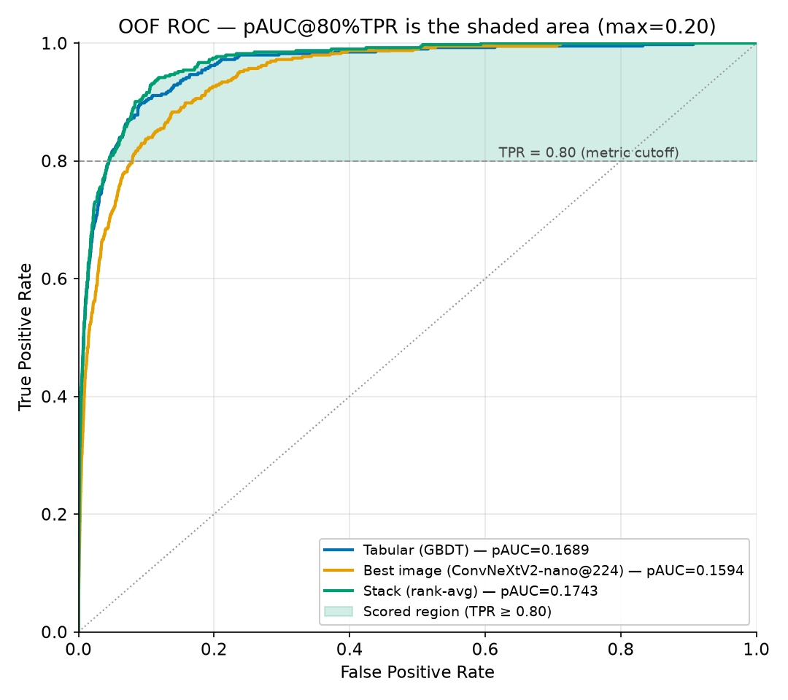
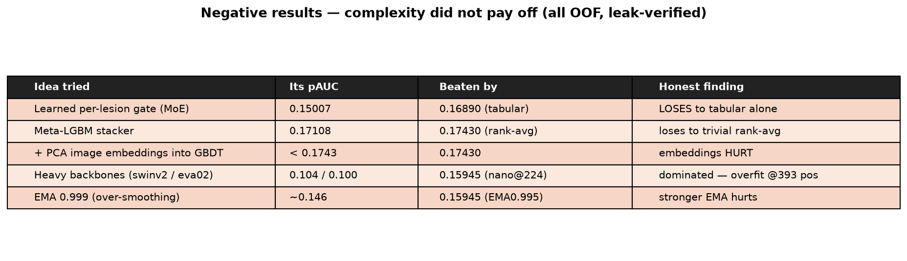

# Abstract

We study the ISIC-2024 SLICE-3D skin-lesion task — classifying ~401,059 lesion crops extracted
from 3D total-body photography as malignant or benign — under a deliberately strict regime: the
**SLICE-3D dataset only**, **no external dermoscopy data**, and **no generative / synthetic
positives**. The competition's top private-leaderboard solutions reached pAUC ≈ 0.173, but did so
by importing external archives and ~30,000 diffusion-synthesized malignant lesions; we ban both.
Because the absolute number is then out of reach by construction, we re-pose the task as a
**quality-vs-cost Pareto frontier**: the best official partial-AUC above 80% TPR achievable per
unit of inference cost (parameters, FLOPs, single-thread CPU latency). A hybrid pipeline — a
LightGBM tabular expert over intrinsic engineered features plus a small ImageNet-pretrained image
backbone, fused by a trivial rank-average — reaches **out-of-fold pAUC 0.17430** at 15.8 M
params / 2.46 GFLOPs / 61 ms CPU. The recurring finding: **every increase in model complexity we
tried lost.** At 393 positives, the small backbone, the zero-parameter combiner, and intrinsic
tabular features are both cheaper and more accurate.

# The task and the metric

ISIC-2024 SLICE-3D contains **401,059** lesion crops from **1,042** patients: **393 malignant**
vs **400,666 benign** — a prevalence of **0.098%** (≈ 1 in 1,021). The official metric is the
**partial AUC above 80% TPR** (pAUC@80), the area under the ROC restricted to the high-sensitivity
band TPR ≥ 0.80; it is bounded in `[0, 0.20]` (random ≈ 0.02, perfect = 0.20). We pin **80% TPR**
(not the 88% mentioned in the public metrics repo README) and compute it only via `src/cv.py`,
proven numerically identical to the vendored official scorer.

# Scope and discipline

Three locked constraints make the claim meaningful: (1) **single dataset** — ISIC-2024 SLICE-3D
only, no ISIC-2019/2020, no PAD-UFES, no external dermoscopy; ImageNet-pretrained *weights* are
allowed (no skin labels), external *training data* is not; (2) **no synthetic augmentation** —
fabricating pathology is a label-validity hole; classical augmentation only; (3) **sacred
validation** — patient-grouped, target-stratified StratifiedGroupKFold (5 folds, SEED = 42),
frozen once into `data/folds.parquet`, shared by every model, with a `cv-guardian` agent holding
veto power. In this competition leaky CV sent teams ~200 places down on the private split.

# Data and EDA

The crops are variable-size square JPEGs, 61–239 px (median/mean ≈ 131/133 px), ~2.8 KB each, so
128 px training is near-native and 224 px *upsamples* (the 224 px gain is capacity/training, not
extra pixels). Head/neck carries ~7× the baseline malignant rate; hue `tbp_lv_H` reaches
univariate AUC 0.81; malignant lesions are ~2× larger; and the **ugly-duckling sign** is
quantitatively present — 392/393 positives sit among the same patient's benign moles, at a median
**88th within-patient size percentile**. Train-only leak columns (`iddx_*`, `mel_thick_mm`,
`mel_mitotic_index`, `lesion_id`, `tbp_lv_dnn_lesion_confidence`) are dropped.

{width=85%}

{width=85%}

# Methods

**Tabular FE** (`src/features.py`): geometry/size ratios, color/hue/luminance contrasts,
border/shape composites, 3D position, and the decisive **patient-relative ugly-duckling**
deviations (`pdev_` / `prank_` / `pxc_`), plus per-fold smoothed target encoding — all computed
fold-locally for leak-safety.

**GBDT** (`src/gbdt.py`): an early underfit bug (`is_unbalance` + AUC early-stop → `best_iter=1`,
pAUC 0.099) was fixed by dropping `is_unbalance` and early-stopping on the official pAUC. The
production expert bags 5-seed LightGBM with manual ~1% undersampling and rank-blends CatBoost
(weight 0.2) → **OOF pAUC 0.16890** at near-zero cost.

**Image experts** (`src/vision/*`): small natural-image-pretrained backbones at 128/224 px, with
per-epoch negative undersampling to ~1:1 (≈4.5 s/epoch; full 5-fold ≈ 8 min), BCE + label
smoothing 0.05, `transV2` augmentation, EMA(0.995) + mixup. A 12-backbone sweep draws the
frontier; heavy transformers collapse at 393 positives.

**Stacking** (`src/stack.py`): a **rank-average** of the GBDT and image OOFs — param-free and
robust — beats a meta-LightGBM stacker, a learned per-lesion gate, and the addition of image
embeddings.

A principled future direction is **self-supervised pretraining** (MAE / DINOv2) on the 400k+
unlabeled crops, as the in-constraint substitute for the banned external data.

# Results

All numbers are out-of-fold, scored only by `src/cv.py` at 80% TPR, and independently re-derived
from the OOF parquets by the `cv-guardian`.

| Model | OOF pAUC@80%TPR | Params (M) | GFLOPs | CPU ms/img |
|---|---|---|---|---|
| GBDT (tabular only) | 0.16890 | 0.86 | ~0 | 0.02 |
| Best image (convnextv2_nano@224) | 0.15945 | 14.98 | 2.46 | 60.9 |
| **Stack rank-avg[GBDT, nano@224]** | **0.17430** | 15.84 | 2.46 | 60.9 |
| Cheap stack (gbdt+3img+udk) | 0.17117 | 23.84 | 1.22 | 32.9 |
| effvit_b0 (cheap frontier) | 0.13706 | 2.13 | 0.034 | 3.5 |
| mnv4_small (latency floor) | 0.11242 | 2.49 | 0.062 | 3.1 |

{width=95%}

{width=80%}

Per-fold: tabular 0.1693 ± 0.0112, image 0.1597 ± 0.0085, **stack 0.1749 ± 0.0068** — the stack
is both the most accurate and the most stable (wins/ties on every fold). Patient-relative
features account for ~65% of total GBDT gain. A fair private-test projection is the OOF headline
minus ~0.01–0.02.

# Ablations and negative results

| Track | Progression / finding | pAUC |
|---|---|---|
| Tabular | broken → fixed → +ugly-duckling → bagged+CatBoost | 0.099 → 0.118 → 0.144 → **0.169** |
| Image | nano@128 → nano@224; heavy backbones collapse | 0.153 → **0.159**; Swin/EVA 0.104/0.100 |
| Stack | rank-avg **wins** vs meta-LGBM vs gate vs +embeddings | **0.1743** vs 0.171 vs 0.150 vs <0.174 |

{width=90%}

The structural reason: every learned add-on must fit its parameters from the same 393 positives
the base experts already used; a zero-parameter rank-average cannot overfit. **Complexity
consistently lost — that is the contribution.**

# Reproducibility

Conda env `isic2024` (Python 3.12, torch 2.11.0+cu128), `SEED = 42` everywhere, frozen
`data/folds.parquet`, single RTX 4070 Ti SUPER 16 GB. Commands: `make folds` (always first) →
`make gbdt` → `make vision CFG=...` → `make frontier` → `make test` (9/9) → `make site`. The
`cv-guardian` reproduced all headline numbers from disk.

# Credits and positioning

We credit the leaderboard champions — 1st place **Ilya Novoselskiy** (EVA-02 + EdgeNeXt + GBDT,
private pAUC 0.17264; used external ISIC data + ~30k synthetic lesions, both banned here; their
own ablation shows synthetic added only +0.0007), 2nd **uchiyama33**, 3rd **kyohei-123** — and
the public-notebook lineage we learned from (greysky's tabular recipe, snnclsr, motono0223,
andreasbis's "CNN preds as features", richolson). Our own contributions are the efficiency
frontier as the deliverable, the audited no-external/no-synthetic discipline, the image-space
ugly-duckling, and the honest negative-results catalogue. We claim SOTA *within the
no-external/no-synthetic class*, not against the unconstrained ~0.1755.

# References

::: {#refs}
:::
