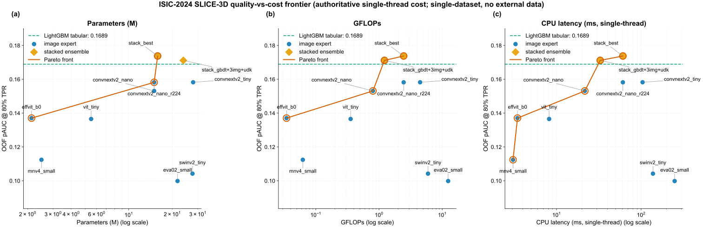
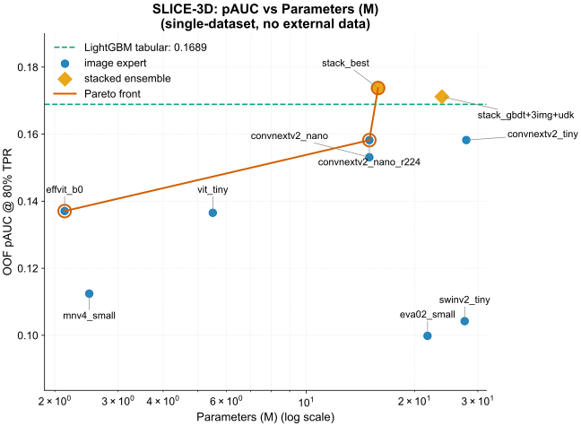
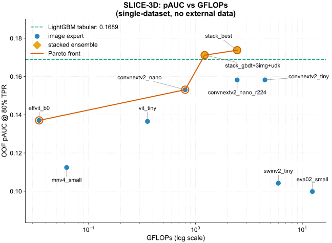
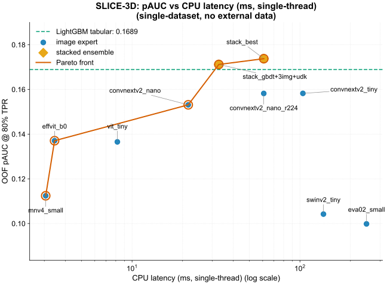
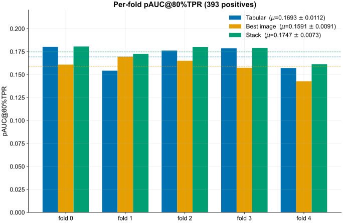
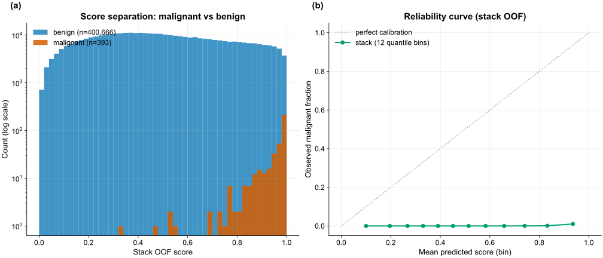

All numbers are out-of-fold on the frozen patient-grouped folds (5 folds, SEED = 42), scored only
by `src/cv.py` at 80% TPR, and independently re-derived from the OOF parquet files by the
`cv-guardian` agent. Figures come from `reports/frontier.py` and `reports/perf/make_perf.py`.

## Headline numbers

| Model | OOF pAUC@80%TPR |
|---|---:|
| Tabular GBDT | **0.16890** |
| Best image (ConvNeXtV2-nano &#64;224) | 0.15821 |
| **Stack — rank-avg[GBDT, nano&#64;224]** | **[0.17376]{.metric-chip}** |

The stack reconstruction `rank-avg[gbdt, r224]` recomputes to 0.17376, matching the canonical
`stack_oof.parquet` exactly; the combiner is a 2-way rank average. Image and tabular make
complementary errors, so the rank-average yields +0.0049 over tabular alone.

### Tabular progression



The tabular expert progresses from a broken baseline (0.09941) to the production
LightGBM+CatBoost ensemble (0.16890); the patient-relative feature block is the single largest
step (see [Ablations → Tabular](ablations.qmd#tabular)).

## The quality-vs-cost frontier (three axes)

A point is Pareto-optimal if no other model is both cheaper and more accurate. The frontier is
drawn against all three cost axes, since cost means different things in different deployments.

### Combined view

{#fig-frontier}

### Versus parameters

{#fig-frontier-params}

### Versus FLOPs

{#fig-frontier-gflops}

### Versus CPU latency

{#fig-frontier-cpu}

### All experiments and the Pareto-optimal set



::: {.callout-note}
## Reading the frontier
- The GBDT alone is near-free and already at 0.169; it dominates every image-only model on cost
  and most on accuracy. This motivates the GBDT-first architecture.
- The image expert earns its place only inside the stack: +0.0049 pAUC for +60 ms. Whether that
  trade is worthwhile is a deployment decision, which is why a frontier is reported, not a single
  number.
- The heavy backbones (`mnv5_300m` at 294 M / 765 ms, `eva02_small`, `swinv2_tiny`) are far off
  the frontier, dominated on both axes. Added capacity reduces the score at 393 positives.
:::

## The scored ROC region

{#fig-roc}

{#fig-roc-zoom}

The shaded band is the region the metric integrates — the area under the ROC for TPR ≥ 0.80
(equivalently FPR ≤ 0.20). In that band the stack sits above both single experts: the +0.0049
lift is concentrated where it is scored, not in low-sensitivity operating points.

## Per-fold stability

{#fig-perfold}

| Fold | Tabular | Best image | Stack |
|---|---:|---:|---:|
| 0 | 0.18014 | 0.16087 | 0.18061 |
| 1 | 0.15424 | 0.16947 | 0.17246 |
| 2 | 0.17614 | 0.16499 | 0.18003 |
| 3 | 0.17871 | 0.15733 | 0.17898 |
| 4 | 0.15708 | 0.14277 | 0.16139 |
| **mean ± std** | **0.1693 ± 0.0112** | **0.1591 ± 0.0091** | **0.1747 ± 0.0073** |

::: {.callout-important}
## Fold variance is the dominant uncertainty
At 393 positives, per-fold pAUC swings by ~0.025 (tabular ranges 0.154 → 0.180), so fold-to-fold
variance exceeds the gap between models; a single-fold number would be untrustworthy. The stack
has the lowest std (0.0073) and wins or ties on every fold — the strongest evidence the +0.0049
is real, and it is both the most accurate and the most stable estimator.
:::

## Feature importance

{#fig-featimp}

Aggregated mean gain over 25 LightGBM + 25 CatBoost boosters (each booster normalized to sum = 1
for cross-library comparability, then averaged):

| Rank | Feature | Gain % |
|---:|---|---:|
| 1 | `tbp_lv_H` (hue) | 3.28 |
| 2 | `pdev_tbp_lv_H` | 3.05 |
| 3 | `pdev_clin_size_long_diam_mm` | 2.19 |
| 4 | `pxc_tbp_lv_H_tbp_lv_location` | 1.88 |
| 5 | `clin_size_long_diam_mm` | 1.68 |
| 6 | `prank_tbp_lv_H` | 1.48 |
| 7 | `z_clin_size_long_diam_mm` | 1.46 |
| 8 | `pdev_tbp_lv_Hext` | 1.25 |
| 9 | `pxc_tbp_lv_H_anatom_site_general` | 1.09 |
| 10 | `f_normalized_lesion_size` | 1.07 |

Patient-relative ugly-duckling features (`pdev_` / `prank_` / `pxc_`) make up 56% of top-20 gain
and ~65% of total gain. A lesion's deviation from its own patient's distribution is the dominant
signal, confirming the tabular architecture.

## Score separation & calibration

{#fig-calib}

Malignant score-mass concentrates near 1.0 and benign mass near 0.0, with the mid-range overlap
penalized by the partial-AUC region. The reliability curve shows the model separates classes well
by rank but is far from probability-calibrated (observed malignant fraction stays ≈0 even in the
top bin). Under 0.1% prevalence and a rank-based metric, calibration is irrelevant to pAUC.

## The CV → private projection

::: {.callout-warning}
## What to expect on a hidden test set
The field saw a ~0.013–0.021 public→private drop on this task even with clean CV, driven by the
393-positive scale and (for the winners) reliance on external/synthetic data. The headline is
OOF CV 0.1738 (stack) / 0.1689 (tabular); a fair private-test projection is headline minus
~0.01–0.02. Because no part of the pipeline saw out-of-distribution data, the OOF number is a
conservative predictor of generalization.
:::

## Leaderboard context



The constrained CV result (0.17376) sits in the same range as the unconstrained 1st-place private
pAUC (0.17264), achieved without the external and synthetic data the champions relied on. The
out-of-fold CV is not directly comparable to a private-LB number; see
[Submission](submission.qmd) and [Credits](credits.qmd).

---

*Continue to [Ablations →](ablations.qmd)*
