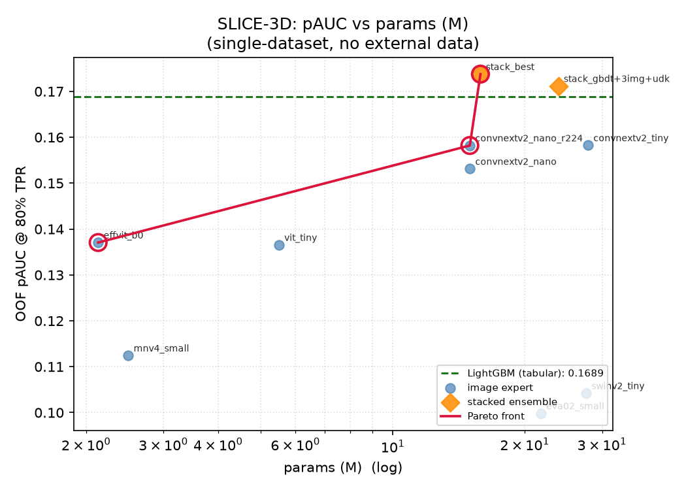
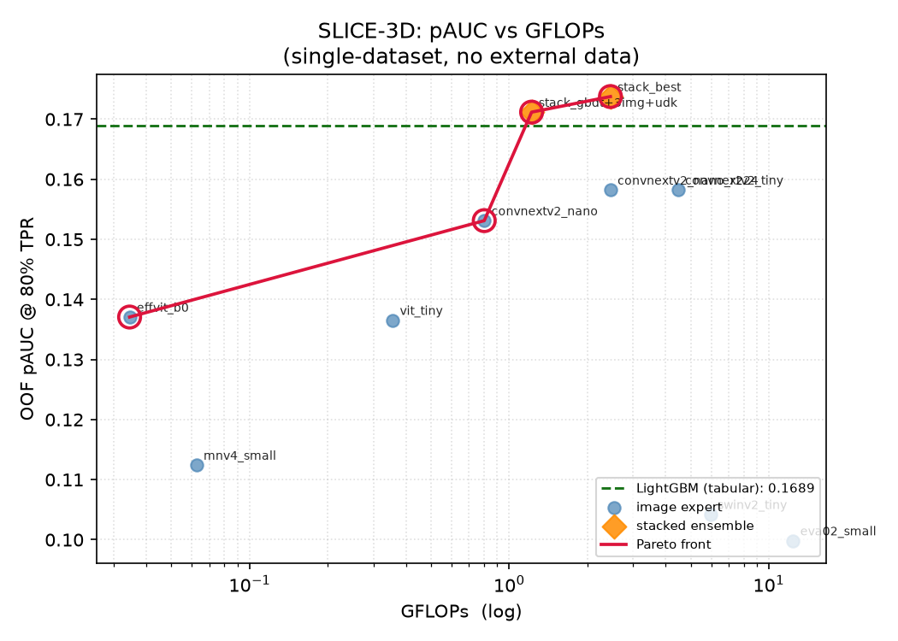
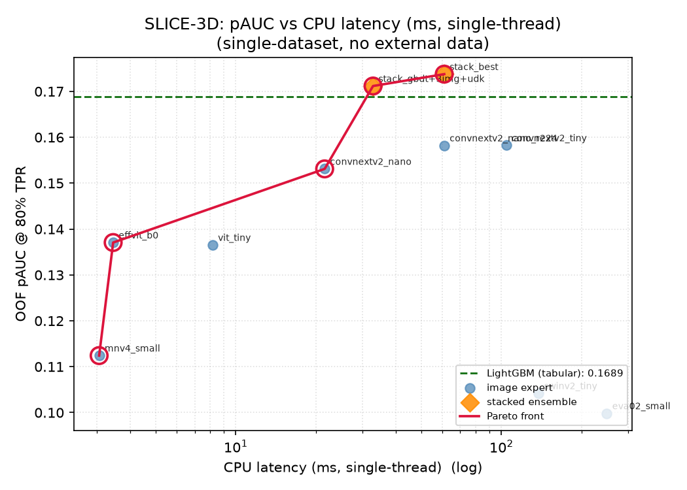
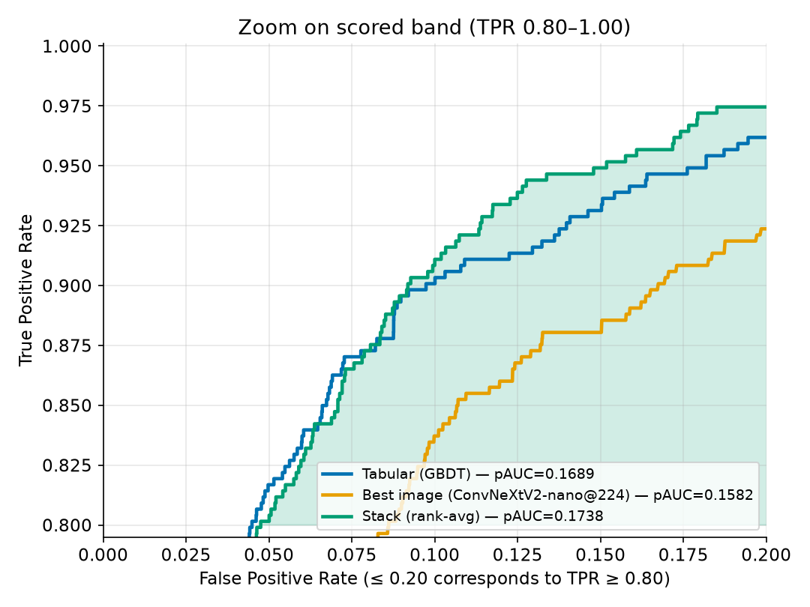
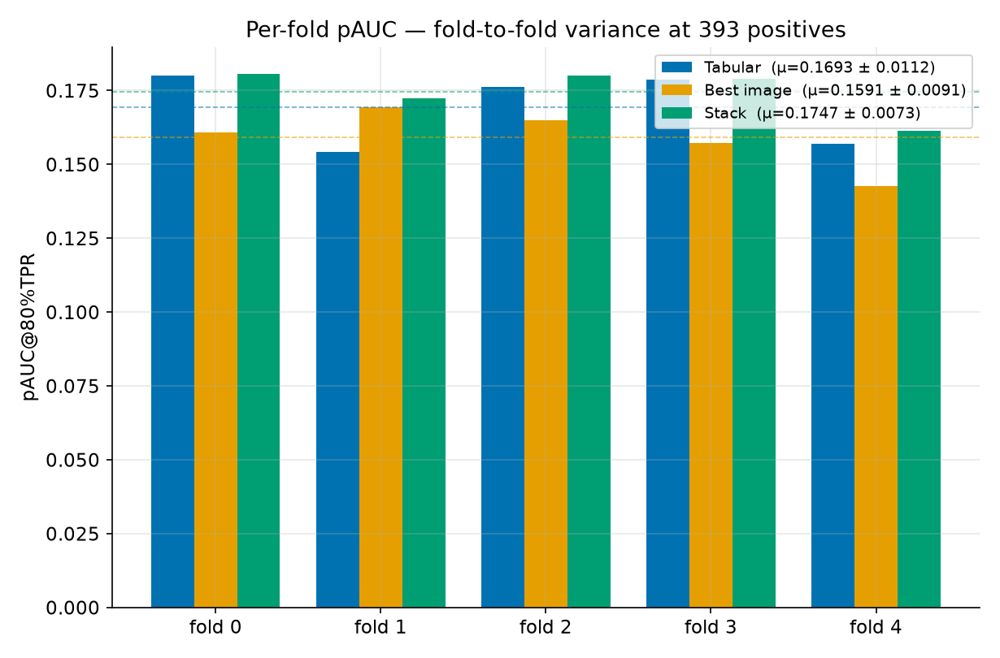
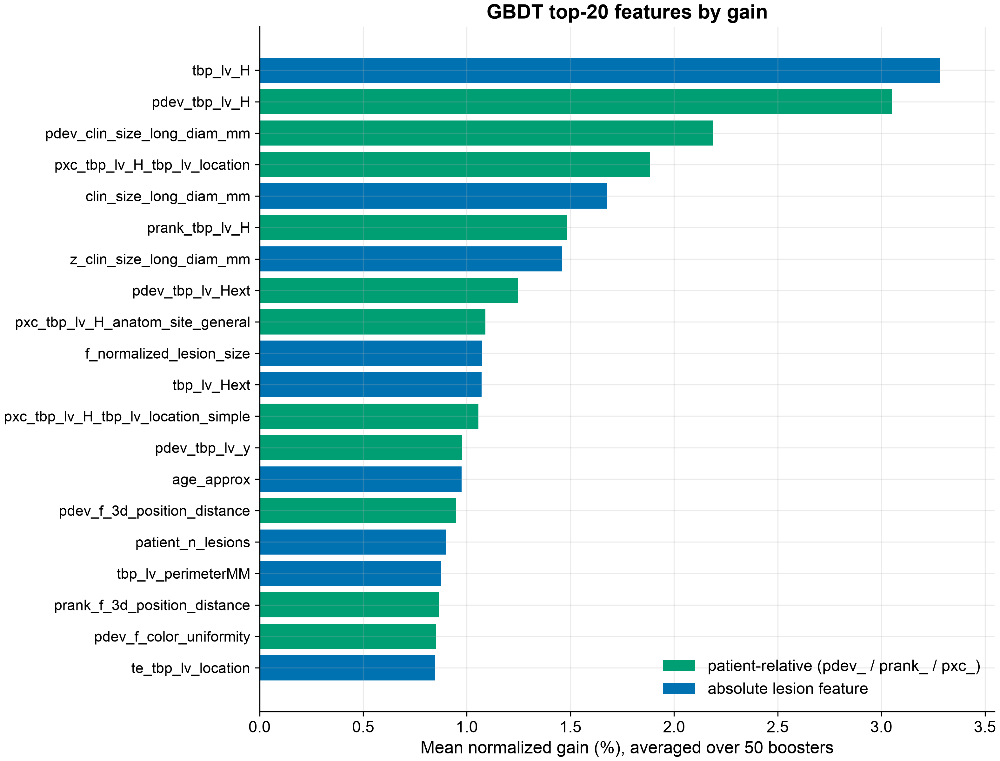
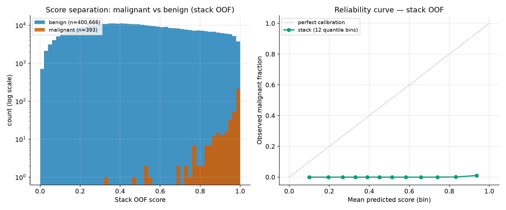

All numbers are **out-of-fold** on the frozen patient-grouped folds (5 folds, SEED = 42), scored
**only** by `src/cv.py` at **80% TPR**, and independently re-derived from the OOF parquet files
by the `cv-guardian` agent. Figures come from `reports/frontier.py` and `reports/perf/make_perf.py`.

## Headline numbers

| Model | OOF pAUC@80%TPR |
|---|---:|
| Tabular GBDT | **0.16890** |
| Best image (ConvNeXtV2-nano &#64;224) | 0.15821 |
| **Stack — rank-avg[GBDT, nano@224]** | **[0.17376]{.metric-chip}** |

The stack reconstruction `rank-avg[gbdt, r224]` recomputes to **0.17376**, matching the canonical
`stack_oof.parquet` exactly — the combiner is genuinely a 2-way rank average, with nothing
hidden. Image and tabular make **complementary errors**, so the trivial rank-average buys
**+0.0049** over tabular alone.

## The quality-vs-cost frontier (three axes)

A point is **Pareto-optimal** if no other model is both cheaper *and* more accurate. We draw the
frontier against all three cost axes, because "cost" means different things in different
deployments.

### Combined view

{#fig-frontier}

### Versus parameters

{#fig-frontier-params}

### Versus FLOPs

{#fig-frontier-gflops}

### Versus CPU latency

{#fig-frontier-cpu}

### The Pareto-optimal set

Reading across the three axes, the defensible frontier points are:

| Frontier point | pAUC | Params (M) | GFLOPs | CPU ms/img | Why it is on the frontier |
|---|---:|---:|---:|---:|---|
| `mnv4_small` &#64;128 | 0.11242 | 2.49 | 0.062 | **3.06** | the cheapest usable point (latency floor) |
| `effvit_b0` &#64;128 | 0.13706 | **2.13** | **0.034** | 3.45 | most accuracy per FLOP/param |
| **GBDT** | 0.16890 | 0.86 | ~0 | **0.02** | dominates everything on cost — the anchor |
| Cheap stack `gbdt+3img+udk` | 0.17117 | 23.84 | 1.22 | 32.9 | second-best accuracy, ~half the latency of best |
| **Stack `gbdt+nano@224`** | **0.17376** | 15.84 | 2.46 | 60.9 | **best accuracy** on the whole study |

::: {.callout-note}
## How to read this
- The **GBDT alone** is almost free and already at 0.169 — it dominates every image-only model
  on cost, and most on accuracy too. This is why the architecture is GBDT-first.
- The image expert only earns its place **inside the stack**: `+0.0049` pAUC for `+60 ms`. Whether
  that trade is worth it is a deployment decision — which is exactly why we report a frontier,
  not a single number.
- The heavy backbones (`mnv5_300m` at 294 M / 765 ms, `eva02_small`, `swinv2_tiny`) are **far off
  the frontier**: dominated on both axes. More capacity is actively harmful at 393 positives.
:::

## The scored ROC region

{#fig-roc}

{#fig-roc-zoom}

The shaded band is **exactly what the metric integrates** — the area under the ROC for TPR ≥
0.80 (equivalently FPR ≤ 0.20). In that scored band the **stack sits above both single experts**:
the visual confirmation that the +0.0049 lift is concentrated where it is scored, not smeared
across useless low-sensitivity operating points.

## Per-fold stability

{#fig-perfold}

| Fold | Tabular | Best image | Stack |
|---|---:|---:|---:|
| 0 | 0.18014 | 0.16087 | 0.18061 |
| 1 | 0.15424 | 0.16947 | 0.17246 |
| 2 | 0.17614 | 0.16499 | 0.18003 |
| 3 | 0.17871 | 0.15733 | 0.17898 |
| 4 | 0.15708 | 0.14277 | 0.16139 |
| **mean ± std** | **0.1693 ± 0.0112** | **0.1591 ± 0.0091** | **0.1747 ± 0.0073** |

::: {.callout-important}
## Fold variance is the dominant uncertainty — and the stack tames it
At 393 positives, per-fold pAUC swings by ~0.025 (tabular ranges 0.154 → 0.180 across folds), so
**fold-to-fold variance is larger than the gap between models.** This is why a single-fold number
would be untrustworthy. The strongest evidence the +0.0049 is real and not a fluke: the **stack
has the lowest std (0.0073) and wins or ties on *every* fold**. It is both the most accurate and
the most stable estimator we have.
:::

## Feature importance — where the signal lives

{#fig-featimp}

Aggregated mean **gain** over 25 LightGBM + 25 CatBoost boosters (each booster normalized to
sum = 1 so the two libraries are comparable, then averaged):

| Rank | Feature | Gain % |
|---:|---|---:|
| 1 | `tbp_lv_H` (hue) | 3.28 |
| 2 | `pdev_tbp_lv_H` | 3.05 |
| 3 | `pdev_clin_size_long_diam_mm` | 2.19 |
| 4 | `pxc_tbp_lv_H_tbp_lv_location` | 1.88 |
| 5 | `clin_size_long_diam_mm` | 1.68 |
| 6 | `prank_tbp_lv_H` | 1.48 |
| 7 | `z_clin_size_long_diam_mm` | 1.46 |
| 8 | `pdev_tbp_lv_Hext` | 1.25 |
| 9 | `pxc_tbp_lv_H_anatom_site_general` | 1.09 |
| 10 | `f_normalized_lesion_size` | 1.07 |

**Patient-relative ugly-duckling features** (`pdev_` / `prank_` / `pxc_`) make up **56% of
top-20 gain and ~65% of total gain.** A lesion's deviation from its own patient's distribution
is the dominant signal — the quantitative vindication of the architecture's tabular thesis.

## Score separation & calibration

{#fig-calib}

Malignant score-mass concentrates near 1.0 and benign mass near 0.0, with the mid-range overlap
that the partial-AUC region penalizes. The reliability curve shows the model separates classes
well **by rank** but is **far from probability-calibrated** (observed malignant fraction stays ≈0
even in the top bin). This is **expected and fine**: under 0.1% prevalence and a rank-based
metric, calibration is irrelevant to pAUC. It is a feature of the design, not a defect.

## The honest CV → private projection

::: {.callout-warning}
## What to expect on a hidden test set
The field saw a roughly **0.013–0.021 public→private drop** on this task even with clean CV —
driven by the 393-positive scale and (for the winners) heavy reliance on external/synthetic data.
Our headline is **OOF CV 0.1738 (stack) / 0.1689 (tabular)**; a fair private-test projection is
**headline minus ~0.01–0.02**. We state this openly. Because **no part of our pipeline ever saw
out-of-distribution data**, our OOF number is, if anything, a *more* honest predictor of
generalization than a leaderboard-tuned score.
:::

---

*Continue to [Ablations →](ablations.qmd)*
